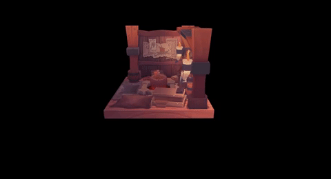

# Ash Survival Kit
My own attempt at [Vulkan Tutorial](https://vulkan-tutorial.com) using Rust with [Ash](https://github.com/MaikKlein/ash).

## Status

Currently the code only works with Windows, but one of the eventual goals is to port all platform-specific code to Linux, and perhaps OSX as a stretch goal.
